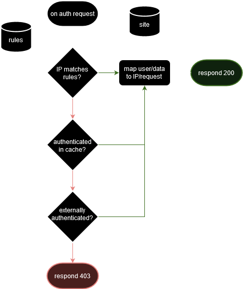

# wrauth

## What?

wrauth is a [WireGuard](https://www.wireguard.com/) management interface and IPv4 authentication provider that:

- extends existing [Authelia](https://www.authelia.com/) access control rules and user database by adding site specific headers and IP to user linking.
- has a web UI to manage WireGuard peers (and for peers to manage themselves) written in plain HTML and CSS, no JS.
    - create: create a new connection if none exist for an account.
    - view: view existing connections as a QR code to scan (on WireGuard mobile) or as a `wireguard.conf` file.
    - link: link a new connection to an existing account.
    - delete: delete a connection from an account.
- comes with [nginx](https://nginx.org/) [auth_request](https://nginx.org/en/docs/http/ngx_http_auth_request_module.html) capabilities out of the box.
- [goes fast, really fast.](docs/bench.md)

### UI

TODO

## Why?

I needed something to authenticate users based on their WireGuard IP addresses better than basic [nginx access](https://nginx.org/en/docs/http/ngx_http_access_module.html) and also easily manage creating new peers, quickly generate QR codes and configuration files.  
this also had to be done in conjunction with 2FA or some other form of authentication, which allows connections from outside the VPN IP range.  
the drive for automation is always present but this seemed to be a good project to take on and I'd finally be contributing back to the selfhosted community I've taken so much from.  

## How?

wrauth is written in [Go](https://go.dev/) and it uses [gnet v2](https://github.com/panjf2000/gnet), [quicktemplate](https://github.com/valyala/quicktemplate), [wgctrl](https://pkg.go.dev/golang.zx2c4.com/wireguard/wgctrl), [goccy/go-yaml](https://github.com/goccy/go-yaml), [fsnotify](https://github.com/fsnotify/fsnotify) and [zap](https://github.com/uber-go/zap).

### external

### internal

where green is for success, red for failure and yellow for conditional.  

details are covered in the [documentation](#documentation).

## And?

### Documentation?

[here](docs/README.md)

### Security?

- wrauth is HTTPS only (preferably also TLSv1.3[^a] only, which every major browser[^b] & library[^c] supports since ~2019 (except Internet Explorer of course)). this circumvents any misconfiguration on the user side[^d] leading to unencrypted transport of things like private keys and so on.
- since public IPv4 addresses are extremely variable[^1] and IPv6 is not supported, it is **absolutely necessary** for WireGuard subnets to be a subset of any of the private use address ranges[^2]. These are official address ranges that are "meant for" virtual networks and are not publicly assigned[^3]. Could be any one of:
    - `10.0.0.0        -   10.255.255.255  (10/8 prefix)`
    - `172.16.0.0      -   172.31.255.255  (172.16/12 prefix)`
    - `192.168.0.0     -   192.168.255.255 (192.168/16 prefix)`
- wrauth provides **host authentication, not user authentication**. it is **not meant** to be the only authentication step in your security flow, it was created and will always be an *addon* to services like Authelia.
- ingress filtering has been best practice since a while[^4], but firewalling on the server is also **seriously recommended**. some simple `nftables` [rules](docs/firewall.md) to make sure packets are being routed in and out of the same subnet and *only* on the WireGuard interface could prevent basic spoofing (but not [DoS](https://en.wikipedia.org/wiki/Denial-of-service_attack) or [MiTM](https://en.wikipedia.org/wiki/Man-in-the-middle_attack) attacks if your network is already compromised).
- nginx needs to pass the correct IP address to the `X-Forwarded-For` header, this depends on the trustworthiness of any previous proxies[^5]. keeping this in mind while designing your overall security flow is very important since a compromised proxy on a subnet could change it's source IP address. nginx's [real_ip module](https://nginx.org/en/docs/http/ngx_http_realip_module.html) could be used for this.

### v1?

there's quite a bit left for the first complete release, which I'll do on a slower timeline since it isn't as urgent as what has been done.

- add WireGuard peer management
    - make HTML/CSS UI 
    - parse and update WireGuard configurations accordingly
    - utilize `wgctrl`'s API entirely
    - use [fasthttp](https://github.com/valyala/fasthttp) for a proper server
    - check that the user is truly over HTTPS
- tighter security
    - ~~actually verify that matched IP addresses are active from WireGuard interfaces~~
    - recheck entire codebase, test edge cases
    - ~~perhaps a better way to cache?~~
- go even faster...
    - somehow manage to benchmark HTTP over unix domain sockets
    - ~~actually add current benchmarks~~
    - ~~cache access control rules and site-specific headers~~
- modularize
    - seperate Authelia specific code, so that adding other authentication backgrounds isn't hard
- QoL
    - add proper support for multiple domains
    - add fast regexp for site-specific headers
    - ~~better panic handling~~
    - safer code (in the memory sense, some of the optimized functions are quite "raw")
    - ~~safer code (in the concurrency sense, some of these could be fatal)~~

### Windows?

what? no.

### Name?

**W**i**R**eguard **AUTH**enticator

[^a]: [RFC8446](https://www.rfc-editor.org/rfc/rfc8446.html) and a [nice article about it](https://blog.cloudflare.com/rfc-8446-aka-tls-1-3/)
[^b]: [TLSv1.3 browser adoption statistics](https://caniuse.com/tls1-3)
[^c]: [OpenSSL](https://wiki.openssl.org/index.php/TLS1.3) & [LibreSSL](https://ftp.openbsd.org/pub/OpenBSD/LibreSSL/libressl-3.1.1-relnotes.txt)
[^d]: [Authelia's HTTPS only architecture](https://www.authelia.com/overview/prologue/architecture/#httphttps)
[^1]: [IPv4 exhaustion (rise in dynamic addresses)](https://en.wikipedia.org/wiki/IPv4_address_exhaustion)
[^2]: [BCP5/RFC1918](https://www.rfc-editor.org/rfc/rfc1918.html)
[^3]: [IANA IPv4 Special-Purpose Address Registry](https://www.iana.org/assignments/iana-ipv4-special-registry/iana-ipv4-special-registry.xhtml)
[^4]: [BCP38/RFC2827](https://www.rfc-editor.org/rfc/rfc2827.html)
[^5]: [X-Forwarded-For security concerns](https://developer.mozilla.org/en-US/docs/Web/HTTP/Headers/X-Forwarded-For#security_and_privacy_concerns)